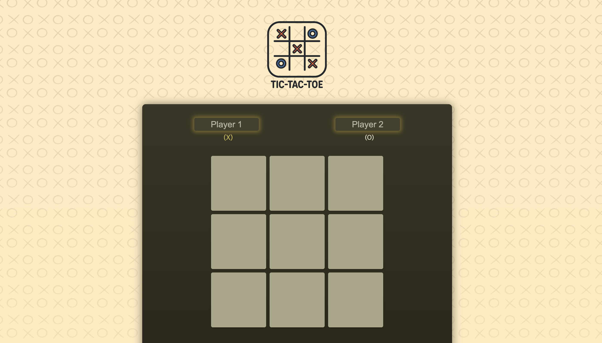
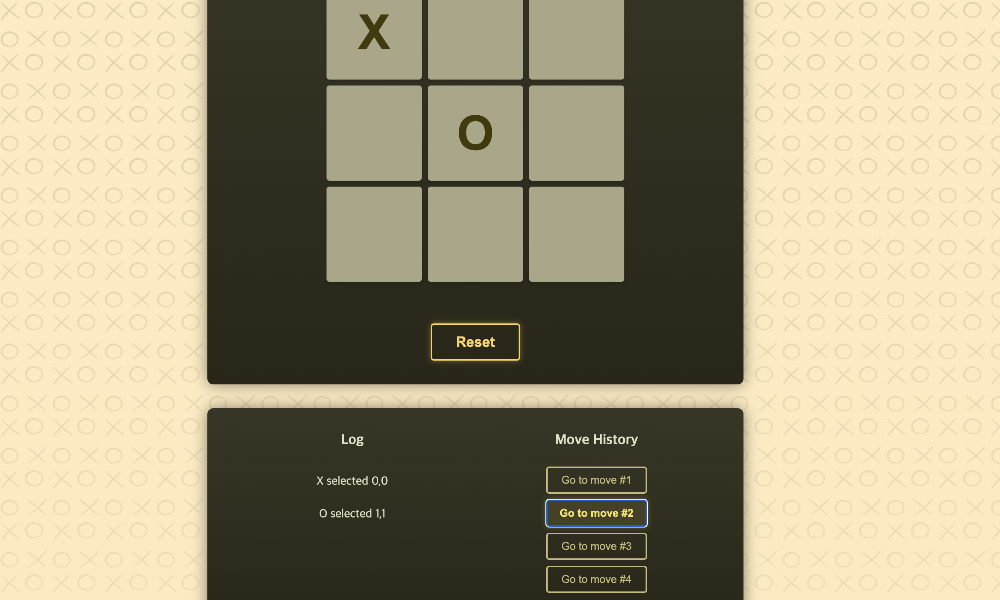
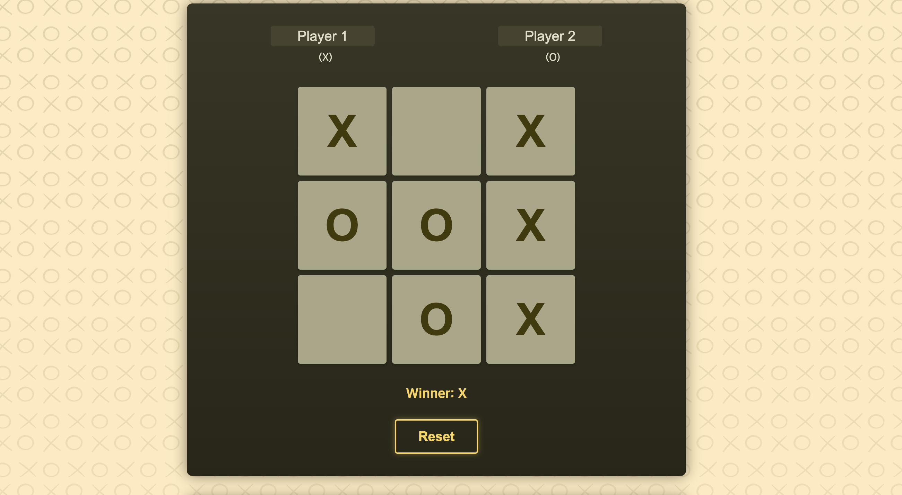

# tic-tac-toe

React 공식 튜토리얼을 기반으로, 상태 구조와 히스토리 처리 방식을 개선해 구현한 틱택토 프로젝트입니다.

## 1. 프로젝트 개요

- 목적: 게임 로직 중심으로 상태 설계, 파생 데이터, 히스토리 분기 처리를 학습
- 핵심 포인트: 턴 기반 데이터 구조, 순수 함수 분리, 시간여행 히스토리
- 개발 형태: 개인 프로젝트

## 2. 링크

- 배포: https://tic-tac-toe-delta-henna-68.vercel.app
- 저장소: https://github.com/guiyoung2/tic-tac-toe

## 3. 주요 기능

- 3x3 보드 플레이
- 승리/무승부 판정
- 플레이어 이름 편집
- 턴 로그 표시
- 히스토리 이동(시간여행) 및 분기 처리
- 게임 초기화

## 4. 공식 튜토리얼 대비 차별점

### 턴 기반 상태 구조

- 공식 튜토리얼의 1차원 `squares` 배열 대신 `gameTurns` 배열을 단일 소스로 사용했습니다.
- 각 턴을 `{ square: { i, j }, player }` 형태로 저장해 보드/로그/승자 판정을 같은 소스에서 파생했습니다.

### 좌표 표현 개선

- 인덱스(0~8) 대신 `{ i, j }` 좌표를 사용해 로직 가독성과 확장성을 높였습니다.

### 히스토리 분기 처리

- 과거 턴으로 이동한 뒤 새 수를 두면 이후 히스토리를 제거하고 새 분기를 생성하도록 구현했습니다.

## 5. 기술 스택

- React
- Vite
- JavaScript (ES6+)

## 6. 핵심 구현 포인트

### 순수 함수 분리

- `checkWinner(gameTurns)`와 `getCurrentPlayer(turns)`를 유틸 함수로 분리해 테스트 가능성과 재사용성을 높였습니다.

### 상태 동기화 안정성

- 현재 플레이어를 별도 상태로 저장하지 않고 턴 수 기반 파생값으로 계산해 상태 불일치를 줄였습니다.

## 7. 프로젝트 구조

```text
src/
├── components/  # GameBoard, Player, Log, History
├── util/        # winning, gameLogic
├── App.jsx
└── main.jsx
```

## 8. 실행 방법

```bash
npm install
npm run dev
```

## 9. 참고

- React 공식 튜토리얼 (Tic-Tac-Toe)

## 10. 스크린샷


### 홈/플레이 화면



- 플레이어 입력, 보드, 로그, 히스토리를 한 화면에서 확인할 수 있도록 구성했습니다.

### 히스토리 이동 화면



- 특정 턴으로 이동한 뒤 상태가 올바르게 복원되는 흐름을 확인할 수 있습니다.

### 게임 종료/리셋 화면



- 승패 판정 이후 즉시 게임을 초기화해 다음 라운드를 시작할 수 있습니다.

## 11. 트러블슈팅

### 1) 과거 턴 이동 후 새 수를 두면 히스토리가 꼬이는 문제

- 문제: 과거 턴으로 이동한 뒤 새 수를 두면 이전 미래 턴 데이터가 남아 UI와 상태가 어긋났습니다.
- 원인: 히스토리 분기 처리 없이 기존 배열 뒤에 새 턴을 추가했습니다.
- 해결: `turnIndex` 기준으로 `history.slice(0, turnIndex + 1)` 후 새 스냅샷을 추가하도록 변경했습니다.
- 결과: 시간여행 이후 재플레이 시 항상 단일 분기 히스토리를 유지해 상태 일관성을 확보했습니다.

### 2) 현재 플레이어 상태와 보드 상태 불일치 문제

- 문제: 현재 플레이어를 별도 상태로 둘 때, 점프/리셋 시 표시 플레이어와 실제 턴이 맞지 않는 경우가 있었습니다.
- 원인: 파생 가능한 값을 독립 상태로 중복 저장해 동기화 포인트가 늘어났습니다.
- 해결: `getCurrentPlayer(turns)`로 `gameTurns`에서 현재 플레이어를 계산하도록 변경했습니다.
- 결과: 표시 상태와 실제 게임 상태의 불일치가 사라졌고 로직 복잡도가 감소했습니다.
